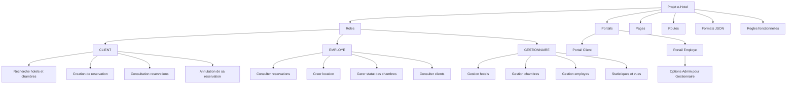
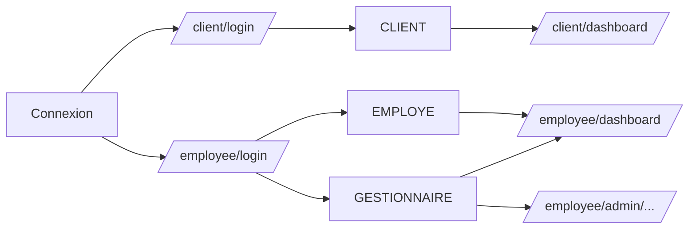
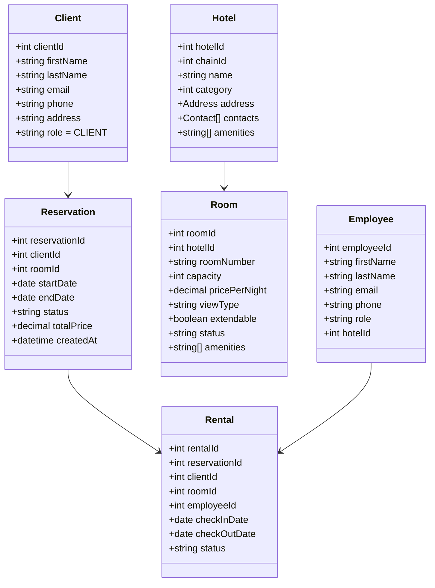
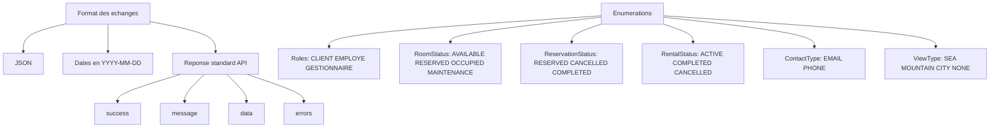
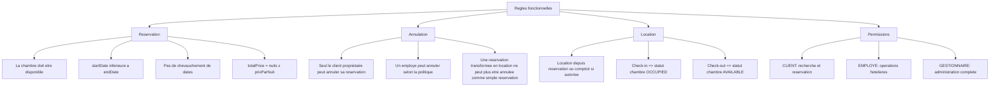
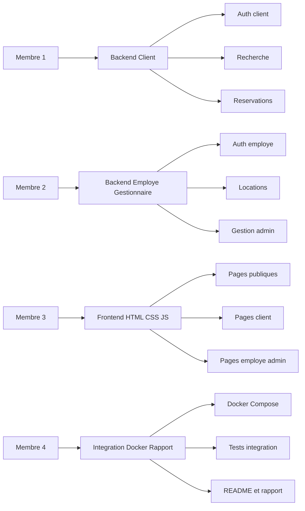

# Spécification e-Hotel

Ce document fixe les décisions d’équipe pour éviter les blocages pendant le développement.

---

## 1. Vue d’ensemble



---

## 2. Connexions et portails



### Rôles exacts

- `CLIENT`
- `EMPLOYE`
- `GESTIONNAIRE`

### Règle retenue

- 2 types de connexion : client et employé
- 3 rôles applicatifs
- le gestionnaire passe par le portail employé avec plus de permissions

---

## 3. Pages principales

```mermaid
flowchart TD
    A[Pages Publiques] --> A1[HomePage]
    A --> A2[HotelListPage]
    A --> A3[HotelDetailsPage]
    A --> A4[RoomSearchPage]
    A --> A5[RoomDetailsPage]

    B[Auth Client] --> B1[ClientLoginPage]
    B --> B2[ClientRegisterPage]

    C[Auth Employe] --> C1[EmployeeLoginPage]

    D[Portail Client] --> D1[ClientDashboardPage]
    D --> D2[ClientProfilePage]
    D --> D3[ClientReservationListPage]
    D --> D4[ClientReservationDetailsPage]
    D --> D5[NewReservationPage]

    E[Portail Employe] --> E1[EmployeeDashboardPage]
    E --> E2[EmployeeReservationListPage]
    E --> E3[EmployeeReservationDetailsPage]
    E --> E4[RentalListPage]
    E --> E5[RentalDetailsPage]
    E --> E6[CustomerListPage]
    E --> E7[CustomerDetailsPage]
    E --> E8[RoomStatusPage]

    F[Gestionnaire] --> F1[AdminHotelListPage]
    F --> F2[AdminHotelFormPage]
    F --> F3[AdminRoomListPage]
    F --> F4[AdminRoomFormPage]
    F --> F5[AdminEmployeeListPage]
    F --> F6[AdminEmployeeFormPage]
    F --> F7[AdminReportsPage]
```



### Arborescence suggérée

```text
/
|-- index.html
|-- client-login.html
|-- client-register.html
|-- employee-login.html
|-- hotels.html
|-- hotel-details.html
|-- room-search.html
|-- room-details.html
|
|-- client/
|   |-- dashboard.html
|   |-- profile.html
|   |-- reservations.html
|   |-- reservation-details.html
|   |-- new-reservation.html
|
|-- employee/
|   |-- dashboard.html
|   |-- reservations.html
|   |-- reservation-details.html
|   |-- rentals.html
|   |-- rental-details.html
|   |-- customers.html
|   |-- customer-details.html
|   |-- rooms.html
|
|-- employee/admin/
|   |-- hotels.html
|   |-- hotel-form.html
|   |-- rooms.html
|   |-- room-form.html
|   |-- employees.html
|   |-- employee-form.html
|   |-- reports.html
|
|-- css/
|   |-- style.css
|
|-- js/
|   |-- main.js
|   |-- client.js
|   |-- employee.js
|   |-- admin.js
```

---

## 4. Routes principales

```mermaid
flowchart TD
    A[Routes principales] --> B[Routes publiques]
    A --> C[Routes client]
    A --> D[Routes employe]
    A --> E[Routes gestionnaire]

    B --> B1[GET /]
    B --> B2[GET /hotels]
    B --> B3[GET /hotels/{hotelId}]
    B --> B4[GET /rooms/search]
    B --> B5[GET /rooms/{roomId}]
    B --> B6[GET /client/login]
    B --> B7[POST /client/login]
    B --> B8[GET /client/register]
    B --> B9[POST /client/register]
    B --> B10[GET /employee/login]
    B --> B11[POST /employee/login]

    C --> C1[GET /client/dashboard]
    C --> C2[GET /client/profile]
    C --> C3[POST /client/profile/update]
    C --> C4[GET /client/reservations]
    C --> C5[GET /client/reservations/{reservationId}]
    C --> C6[POST /client/reservations]
    C --> C7[POST /client/reservations/{reservationId}/cancel]

    D --> D1[GET /employee/dashboard]
    D --> D2[GET /employee/reservations]
    D --> D3[GET /employee/reservations/{reservationId}]
    D --> D4[POST /employee/reservations/{reservationId}/checkin]
    D --> D5[GET /employee/rentals]
    D --> D6[GET /employee/rentals/{rentalId}]
    D --> D7[POST /employee/rentals]
    D --> D8[POST /employee/rentals/{rentalId}/checkout]
    D --> D9[GET /employee/customers]
    D --> D10[GET /employee/customers/{customerId}]
    D --> D11[GET /employee/rooms]
    D --> D12[POST /employee/rooms/{roomId}/status]

    E --> E1[GET /employee/admin/hotels]
    E --> E2[POST /employee/admin/hotels]
    E --> E3[POST /employee/admin/hotels/{hotelId}/update]
    E --> E4[POST /employee/admin/hotels/{hotelId}/delete]
    E --> E5[GET /employee/admin/rooms]
    E --> E6[POST /employee/admin/rooms]
    E --> E7[POST /employee/admin/rooms/{roomId}/update]
    E --> E8[POST /employee/admin/rooms/{roomId}/delete]
    E --> E9[GET /employee/admin/employees]
    E --> E10[POST /employee/admin/employees]
    E --> E11[POST /employee/admin/employees/{employeeId}/update]
    E --> E12[POST /employee/admin/employees/{employeeId}/delete]
    E --> E13[GET /employee/admin/reports]
```

### Liste textuelle

#### Routes publiques
- `GET /`
- `GET /hotels`
- `GET /hotels/{hotelId}`
- `GET /rooms/search`
- `GET /rooms/{roomId}`
- `GET /client/login`
- `POST /client/login`
- `GET /client/register`
- `POST /client/register`
- `GET /employee/login`
- `POST /employee/login`

#### Routes client
- `GET /client/dashboard`
- `GET /client/profile`
- `POST /client/profile/update`
- `GET /client/reservations`
- `GET /client/reservations/{reservationId}`
- `POST /client/reservations`
- `POST /client/reservations/{reservationId}/cancel`

#### Routes employé
- `GET /employee/dashboard`
- `GET /employee/reservations`
- `GET /employee/reservations/{reservationId}`
- `POST /employee/reservations/{reservationId}/checkin`
- `GET /employee/rentals`
- `GET /employee/rentals/{rentalId}`
- `POST /employee/rentals`
- `POST /employee/rentals/{rentalId}/checkout`
- `GET /employee/customers`
- `GET /employee/customers/{customerId}`
- `GET /employee/rooms`
- `POST /employee/rooms/{roomId}/status`

#### Routes gestionnaire
- `GET /employee/admin/hotels`
- `POST /employee/admin/hotels`
- `POST /employee/admin/hotels/{hotelId}/update`
- `POST /employee/admin/hotels/{hotelId}/delete`
- `GET /employee/admin/rooms`
- `POST /employee/admin/rooms`
- `POST /employee/admin/rooms/{roomId}/update`
- `POST /employee/admin/rooms/{roomId}/delete`
- `GET /employee/admin/employees`
- `POST /employee/admin/employees`
- `POST /employee/admin/employees/{employeeId}/update`
- `POST /employee/admin/employees/{employeeId}/delete`
- `GET /employee/admin/reports`

---

## 5. Modèle des données échangées



### Format standard des réponses API

```json
{
  "success": true,
  "message": "Reservation created successfully",
  "data": {
    "reservationId": 101
  }
}
```

### Exemple d’erreur

```json
{
  "success": false,
  "message": "Room is not available for the selected dates",
  "errors": [
    {
      "field": "endDate",
      "error": "Invalid date range"
    }
  ]
}
```

### Énumérations à figer



### Valeurs retenues

#### Rôles
- `CLIENT`
- `EMPLOYE`
- `GESTIONNAIRE`

#### Statut chambre
- `AVAILABLE`
- `RESERVED`
- `OCCUPIED`
- `MAINTENANCE`

#### Statut réservation
- `RESERVED`
- `CANCELLED`
- `COMPLETED`

#### Statut location
- `ACTIVE`
- `COMPLETED`
- `CANCELLED`

#### Type de contact
- `EMAIL`
- `PHONE`

#### Type de vue
- `SEA`
- `MOUNTAIN`
- `CITY`
- `NONE`

---

## 6. Règles fonctionnelles



### Détail des règles

#### Réservation
- un client ne peut réserver qu’une chambre disponible
- `startDate < endDate`
- la chambre ne doit pas être déjà réservée ou occupée sur l’intervalle
- `totalPrice = nombre de nuits × prix par nuit`

#### Annulation
- seul le client propriétaire peut annuler sa réservation
- un employé peut annuler selon la politique définie par l’équipe
- une réservation transformée en location ne peut plus être annulée comme une simple réservation

#### Location
- une location peut venir d’une réservation existante
- une location peut aussi être créée directement au comptoir si vous gardez cette fonctionnalité
- au check-in, le statut de la chambre devient `OCCUPIED`
- au check-out, le statut de la chambre devient `AVAILABLE`

#### Permissions
- `CLIENT` : recherche, consultation, réservation, annulation de ses propres réservations
- `EMPLOYE` : opérations hôtelières courantes
- `GESTIONNAIRE` : administration complète

---

## 7. Répartition du travail entre les 4 membres



### Détail

#### Membre 1 — Backend client
- authentification client
- recherche d’hôtels et de chambres
- création et consultation des réservations
- annulation de réservation

#### Membre 2 — Backend employé / gestionnaire
- authentification employé
- consultation des réservations
- création de locations
- gestion administrative des hôtels, chambres et employés

#### Membre 3 — Frontend HTML/CSS/JS
- pages publiques
- pages client
- pages employé
- pages administrateur

#### Membre 4 — Intégration, Docker, rapport
- configuration Docker Compose
- intégration application + PostgreSQL
- tests d’intégration
- README
- rapport final

---

## 8. Contrat d’équipe

### Conventions
- champs techniques en anglais
- interface utilisateur possible en français
- dates toujours au format `YYYY-MM-DD`
- identifiants uniformes :
  - `clientId`
  - `employeeId`
  - `hotelId`
  - `roomId`
  - `reservationId`
  - `rentalId`

### Structure API standard
- `success`
- `message`
- `data`
- `errors`

### Objectif
Tout le monde doit coder à partir des mêmes noms de champs, mêmes routes, mêmes rôles et mêmes règles.
