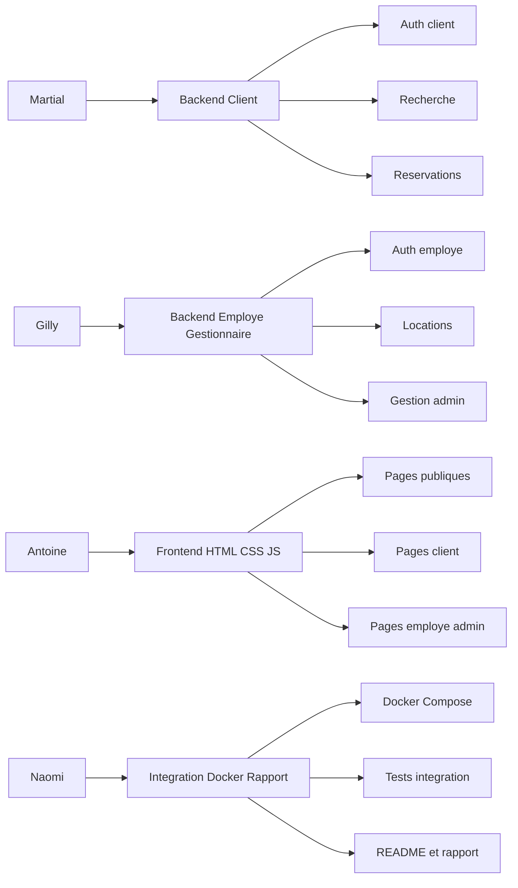

## 8. Répartition du travail

### Répartition détaillée

#### Martial — Backend client
- authentification client
- recherche d’hôtels et chambres
- création, consultation et annulation de réservations
- tableau de bord client

#### Antoine — Backend employé / gestionnaire
- authentification employé
- gestion des réservations et locations
- gestion des clients
- routes admin pour hôtels, chambres, employés et rapports

#### Antoine — Frontend
- pages publiques
- pages client
- pages employé
- pages gestionnaire
- validation HTML/CSS/JS

#### Naomi — Intégration / Docker / rapport
- `Dockerfile`
- `docker-compose.yml`
- initialisation PostgreSQL
- tests d’intégration
- README
- rapport final
